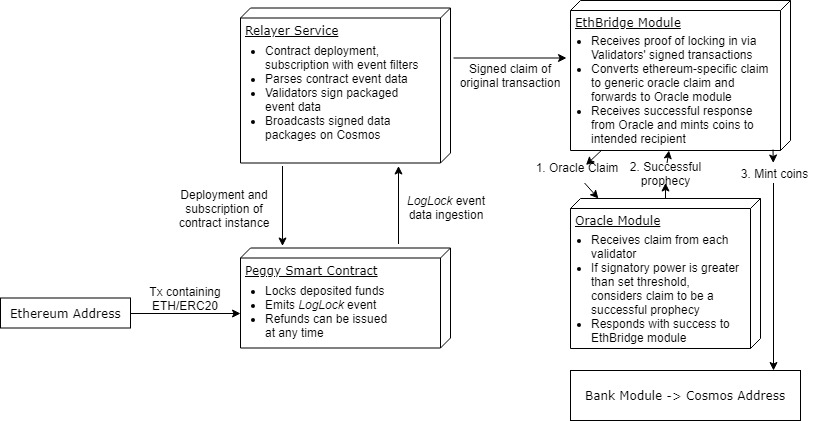

# ETH Bridge Zone

[](https://circleci.com/gh/swishlabsco/cosmos-ethereum-bridge/tree/master)

## Project Summary
Unidirectional Peggy is the starting point for cross chain value transfers from the Ethereum blockchain to Cosmos-SDK based blockchains as part of the Ethereum Cosmos Bridge project. The system accepts incoming transfers of Ethereum tokens on an Ethereum smart contract, locking them while the transaction is validated and equitable funds issued to the intended recipient on the Cosmos bridge chain.

## Project Background
We are hoping to create a closed system for intra network transfers of cryptocurrency between blockchains, spearheaded by a proof-of-concept which enables secured transactions between Ethereum and Cosmos.

## Ethereum Cosmos Bridge Architecture
Unidirectional Peggy focuses on core features for unidirectional transfers. This prototype includes functionality to safely lock and unlock Ethereum, and mint corresponding representative tokens on the Cosmos chain.

The architecture consists of 4 parts. Each part, and the logical flow of operations is described below.

### The smart contracts
First, the smart contract is deployed to an Ethereum network. A user can then send Ethereum to that smart contract to lock up their Ethereum and trigger the transfer flow.

In this prototype, the system is managed by the contract's deployer, designated internally as the relayer, a trusted third-party which can unlock funds and return them their original sender. If the contract’s balances under threat, the relayer can pause the system, temporarily preventing users from depositing additional funds.

The Peggy Smart Contract is deployed on the Ropsten testnet at address: 0x3de4ef81Ba6243A60B0a32d3BCeD4173b6EA02bb. More details on the smart contracts and usage can be found in the ethereum-contracts folder.

### The Relayer
The Relayer is a service which interfaces with both blockchains, allowing validators to attest on the Cosmos blockchain that specific events on the Ethereum blockchain have occurred. Through the Relayer service, validators witness the events and submit proof in the form of signed hashes to the Cosmos based modules, which are responsible for aggregating and tallying the Validators’ signatures and their respective signing power.

The Relayer process is as follows:
 - continually listen for a `LogLock` event
 - when an event is seen, parse information associated with the Ethereum transaction
 - uses this information to build an unsigned Cosmos transaction
 - signs and send this transaction to Tendermint.

### The EthBridge Module
The EthBridge module is a Cosmos-SDK module that is responsible for receiving and decoding transactions involving Ethereum Bridge claims and for processing the result of a successful claim.

The process is as follows:
 - A transaction with a message for the EthBridge module is received
 - The message is decoded and transformed into a generic, non-Ethereum specific Oracle claim
 - The oracle claim is given a unique ID based on the nonce from the ethereum transaction
 - The generic claim is forwarded to the Oracle module.

The EthBridge module will resume later if the claim succeeds.

### The Oracle Module
The Oracle module is intended to be a more generic oracle module that can take arbitrary claims from different validators, hold onto them and perform consensus on those claims once a certain threshold is reached. In this project it is used to find consensus on claims about activity on an Ethereum chain, but it is designed and intended to be able to be used for any other kinds of oracle-like functionality in future (eg: claims about the weather).

The process is as follows:
 - A claim is received from another module (EthBridge in this case)
 - That claim is checked, along with other past claims from other validators with the same unique ID
 - Once a threshold of stake of the active Tendermint validator set is claiming the same thing, the claim is updated to be successful
 - If a threshold of stake of the active Tendermint validator set disagrees, the claim is updated to be a failure
 - The status of the claim is returned to the module that provided the claim.

### The EthBridge Module (Part 2)
The EthBridge module also contains logic for how a result should be processed.

The process is as follows:
 - Once a claim has been processed by the Oracle, the status is returned
 - If the claim is successful, new tokens representing Ethereum are minted via the Bank module

### Architecture Diagram


## Example application
These modules can be added to any Cosmos-SDK based chain, but a demo application/blockchain is provided with example code for how to integrate them. It can be installed and built as follows:

```
# Clone the repository
mkdir -p $GOPATH/src/github.com/swishlabsco
cd $GOPATH/src/github.com/swishlabsco
git clone https://github.com/swishlabsco/cosmos-ethereum-bridge
cd cosmos-ethereum-bridge && git checkout master

# Install dep, as well as your dependencies
make get_tools
dep ensure -v
go get -u github.com/kardianos/govendor

# Fetch the C file dependencies (this is a manual hack, as dep does not support pulling non-golang files used in dependencies)
govendor fetch -tree github.com/ethereum/go-ethereum/crypto/secp256k1

# Install the app into your $GOBIN
make install

# Now you should be able to run the following commands, confirming the build is successful:
ebd help
ebcli help
ebrelayer help
```

## Running and using the application

First, initialize a chain and create accounts to test sending of a random token.

```
# Initialize the genesis.json file that will help you to bootstrap the network
ebd init --chain-id=testing

# Create a key to hold your validator account and for another test account
ebcli keys add validator
# Enter password

ebcli keys add testuser
# Enter password

ebd add-genesis-account $(ebcli keys show validator -a) 1000000000stake,1000000000atom

# Now its safe to start `ebd`
ebd start

# Then, wait 10 seconds and in another terminal window, test things are ok by sending 10 tok tokens from the validator to the testuser
ebcli tx send $(ebcli keys show testuser -a) 10stake --from=validator --chain-id=testing --yes

# Confirm token balances have changed appropriately
ebcli query account $(ebcli keys show validator -a) --trust-node
ebcli query account $(ebcli keys show testuser -a) --trust-node

# Next, setup the staking module prerequisites
# First, create a validator and stake
ebcli tx staking create-validator \
  --amount=100000000stake \
  --pubkey=$(ebd tendermint show-validator) \
  --moniker="test_moniker" \
  --chain-id=testing \
  --commission-rate="0.10" \
  --commission-max-rate="0.20" \
  --commission-max-change-rate="0.01" \
  --min-self-delegation="1" \
  --gas=200000 \
  --gas-prices="0.001stake" \
  --from=validator

# Then wait 10 seconds then confirm your validator was created correctly, and has become Bonded status
ebcli query staking validators --trust-node

# See the help for the ethbridge make claim function
ebcli tx ethbridge make-claim --help

# Now you can test out the ethbridge module by submitting a claim for an ethereum prophecy
# Make a bridge claim (Ethereum prophecies are stored on the blockchain with an identifier created by concatenating the nonce and sender address)
ebcli tx ethbridge make-claim 0 0x7B95B6EC7EbD73572298cEf32Bb54FA408207359 $(ebcli keys show testuser -a) $(ebcli keys show validator -a) 3eth --from validator --chain-id testing --yes

# Then read the prophecy to confirm it was created with the claim added
ebcli query ethbridge get-prophecy 0 0x7B95B6EC7EbD73572298cEf32Bb54FA408207359 --trust-node

# And finally, confirm that the prophecy was successfully processed and that new eth was minted to the testuser address
ebcli query account $(ebcli keys show testuser -a) --trust-node

# Check ebrelayer connection to ebd
ebrelayer status

# Initialize the Relayer service for automatic claim processing
ebrelayer init testing wss://ropsten.infura.io/ws 3de4ef81Ba6243A60B0a32d3BCeD4173b6EA02bb "LogLock(bytes32,address,bytes,address,uint256,uint256)" $(ebcli keys show validator -a)

# Make a claim on the event in active ebrelayer by entering
Y/n

# Enter password associated with the active validator account
password = [VALIDATOR_PASSWORD]

# Depositing funds to Peggy using Remix.ethereum.org  
1. Compile Peggy.sol with solc v0.5.0  
2. Set the environment as Injected Web3 Ropsten  
3. On 'Run' tab, select Peggy and enter "0x3de4ef81Ba6243A60B0a32d3BCeD4173b6EA02bb" in 'At Address' field  
4. Select 'At Address' to load the deployed contract  
5. Enter the following for the variables under function lock():  
  _recipient = [HASHED_COSMOS_RECIPIENT_ADDRESS] (for testuser cosmos1pjtgu0vau2m52nrykdpztrt887aykue0hq7dfh, enter "0x636f736d6f7331706a74677530766175326d35326e72796b64707a74727438383761796b756530687137646668")  
  _token = [DEPLOYED_TOKEN_ADDRESS] (erc20 not currently supported, enter "0x0000000000000000000000000000000000000000" for ethereum)  
  _amount = [WEI_AMOUNT]  
6. Enter the same number from _amount as the transaction's value (in wei)  
7. Select "transact" to send the lock() transaction  

# Depositing funds to Peggy using CLI [coming soon]

```

## Using the application from rest-server

First, run the cli rest-server

```
ebcli rest-server --trust-node
```

An api collection for Postman (https://www.getpostman.com/) is provided [here](./cosmos-ethereum-bridge.postman_collection.json) which documents some API endpoints and can be used to interact with it.
Note: For checking account details/balance, you will need to change the cosmos addresses in the URLs, params and body to match the addresses you generated that you want to check.

## Using the modules in other projects
There are 2 nuances you need to be aware of when using these modules in other Cosmos-SDK projects.
 - A specific version of golang.org/x/crypto (ie tendermint/crypto) is needed for compatability with go-ethereum. See the Gopkg.toml for constraint details
 - The govendor steps in the hack as above are needed

 For instructions on building and deploying the smart contracts, see the README in their folder.