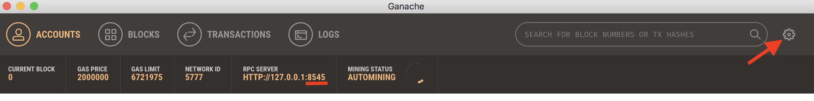
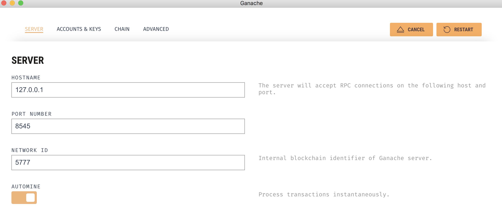
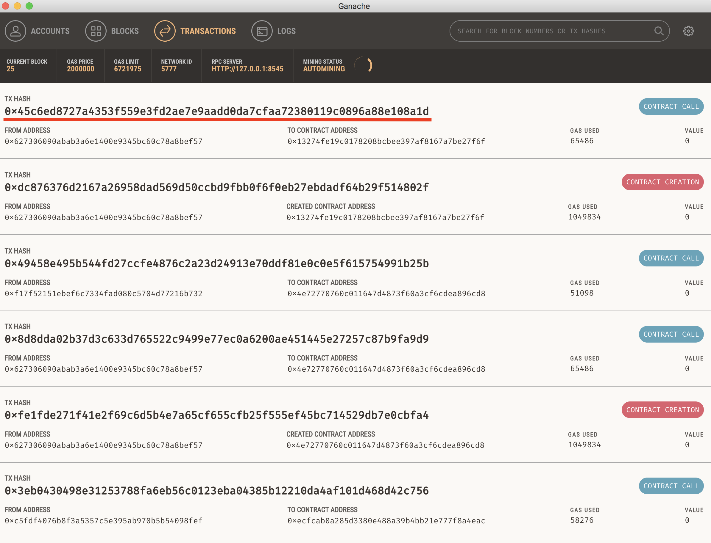

# Testing contracts

## Installing dependencies

  - Truffle: `npm install -g truffle` for Mac or go to the install
  - Testrpc: `npm i -g ethereumjs-testrpc`
  - Ganache: Download file [here](http://truffleframework.com/ganache/)

## Instructions

You can test the contracts using Truffle Testrpc in the console or Ganache UI.

1) **Testrpc**:
    - `$ cd ethereum-contracts`
    - Delete *build* folder an type `$ truffle migrate --reset --compile-all`
    - `$ testrpc`
    - `$ truffle test` on a separate tab


2) **Ganache**:
    - `$ cd ethereum-contracts`
    - Delete *build* folder an type `$ truffle migrate --reset --compile-all`
    - Open Ganache app, open the *Settings* button and make sure it's running on port **_8545_**.
    - `$ truffle test` on a separate tab






### Running tests of specific contracts

    `$ truffle test test/<test_name.js>`

## Debugging

Once you run the contracts you will get the `TX HASH` number of each function call. If not, you can take the `tx` field from the response of the transaction if you print on the respective test file:

  ```
  { tx: '0x2e352263105ff582f3c8e5368e3029819a0862f2e3795279c0726b8b8e6c64f7',
  receipt:
   { transactionHash: '0x2e352263105ff582f3c8e5368e3029819a0862f2e3795279c0726b8b8e6c64f7',
     transactionIndex: 0,
     blockHash: '0x0ae0afbd7d711871e9dde6740ea613bdb22cd9fc4f4c68bac46c22a8bf7e0b5e',
     blockNumber: 529,
     gasUsed: 75600,
     cumulativeGasUsed: 75600,
     contractAddress: null,
     logs: [ [Object] ],
     status: '0x01',
     logsBloom: '0x00000000000000000000000000000000000000000000000000000800000000000000000000000000000000000000000000000000000000000000000000000000000000400000000000000000000000000000000000010000000000000000000000000000000000000000000000000000000000000000000000000000000000000000000000000040002000000000000000000000000000000000000000000000000000000000000000000000000000000000000000000000000000000000000000000000000000000000000000000000000000000000000000000000000000000000000000000000000000000000000000000000000200000000000000000000' },
  logs:
   [ { logIndex: 0,
       transactionIndex: 0,
       transactionHash: '0x2e352263105ff582f3c8e5368e3029819a0862f2e3795279c0726b8b8e6c64f7',
       blockHash: '0x0ae0afbd7d711871e9dde6740ea613bdb22cd9fc4f4c68bac46c22a8bf7e0b5e',
       blockNumber: 529,
       address: '0x1b5163d8309bc23c225ba666507efd036dc1c677',
       type: 'mined',
       event: 'SomeEvent',
       args: [Object] } ] }
  ```

Copy it and on in a separate tab in the console:

  `$ truffle console`

  `$ debug <TX HASH>`

  
