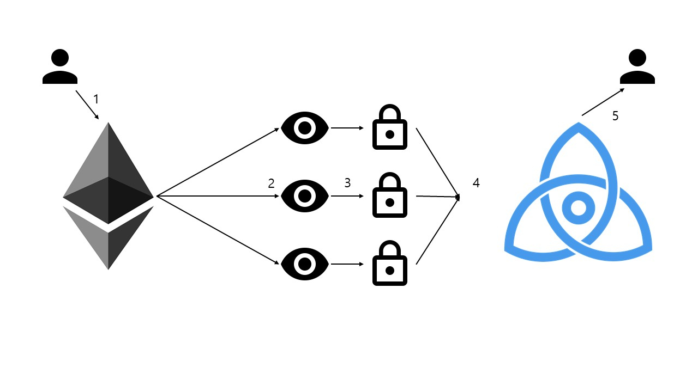
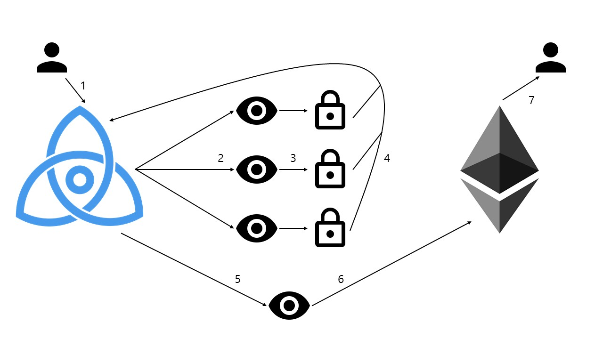

# Specifcation for 2-way peg between a Tendermint chain and an Ethereum chain

#### Terminology
* The *Cosmos Peg Zone* is the blanket term for the four components
involved in Ethereum <-> Tendermint asset transfer.

## Overview
The goal of the Peg Zone is to enable the movement of assets between a Tendermint
chain and an Ethereum chain. It is designed to allow for secure and cheap
transfers of all Ethereum tokens (Ether and ERC20) as well as all Cosmos
tokens.

The Cosmos peg zone accepts and sends IBC packets. When it receives an IBC
packet it processes it and then affects a change on the Ethereum state. When
the app is informed of a state change on Ethereum it generates and sends an IBC
packet.

### Cosmos Peg Zone Components
1. a *Cosmos ABCI app*
1. a set of *signing apps* 
1. a set of Ethereum *smart contracts* 
1. a set of *relayer* processes

#### Cosmos ABCI App
The ABCI app serves as the interface to the peg zone. It communicates
using IBC packets with the hub.

It allows querying of transactions in these ways:

1. query all transactions
1. query all transactions >= a specific block height
1. query all state, including signatures, for a particular transaction

#### Signing Apps
The signing apps sign transactions using secp256k1 such that the
Ethereum smart contracts can verify them. The signing apps also have an
ethereum address, because they have an identity in the Ethereum
contract. They watch for new Ethereum-bound transactions using
the ABCI app's query functionality, and submit their signatures
back to it for replication.

#### Ethereum Smart Contracts
The smart contracts verify updates coming from the ABCI app
using the known keys of the signing apps. The smart contracts
track updates to the set of signing apps, and their associated
signatures. The smart contracts support 6 functions:

1. `lock` ETH or ERC20 tokens for use in Cosmos
1. `unlock` previously-locked (encumbered) ETH or ERC20 tokens
1. `update` signing app set signatures
1. `mint` ERC20 tokens for encumbered denominations
1. `burn` ERC20 tokens for encumbered denominations
1. `register` denomination

#### Relayer Process
The relayer process is responsible for communication
of state changes between Tendermint and Ethereum.
It is stateless, and has at-least-once delivery semantics 
from one chain to another. Every update it delivers to 
either chain is idempotent.

Generally anyone that wants the peg zone to be successful
has an incentive to run the relayer process.

It follows updates to the Ethereum chain by communicating
with a node-local Ethereum node.
When it detects locked or burned updates by the smart contracts,
it sends a signed message to the ABCI app.

# Transfer Protocols

## Sending Ethereum tokens from Ethereum to Cosmos



1. The contract receives a `lock` transaction with a `ERC20` token and a destination address
on the Cosmos side. It locks the received funds to the consensus of the peg
zone, logging an event that notifies the relayers.
1. The relayers process connected via RPC to an Ethereum full node, listening for `Lock` event.
1. Once the node receives a deposit to the smart contract it waits for 100 blocks (finality threshold) and then generates and signs a `SignIncomingMsg` that attests witness to the event
to which the Cosmos peg zone is listening.
1. The peg zone receives witness transactions until a super-majority of the voting power has witnessed an event. Every BeginBlock invocation the peg zone checks whether any incoming Ethereum transfers have reached a super-majority of confirmations.
1. The node then updates the state with an internal transaction to reflect that someone wants to send tokens from Ethereum and generates `IBCIncoming` to mint the tokens to specified destination chain.

## Sending Ethereum tokens from Cosmos to Ethereum



1. The ABCI app receives an `IBCOutgoing` that requests for burning Ethereum tokens and handles it according to the IBC specification. The ABCI app generates a valid Ethereum transaction containing {address, token address, amount, nonce}, and writes it to its state.
1. Each signing app is watching for new transactions in the ABCI state, and detects the new transaction. 
1. Each signing app signs the transaction using secp256k1 using a key that is known to the Ethereum smart contracts.
1. Each signing app submits their signatures back to the ABCI app as `SignOutgoingMsg` for replication.
1. The relayer processes, which periodically query the ABCI app's transactions,
   see that the transaction has reached the required signature threshold. 
1. One of the relayers send the transaction to the smart contract by calling the `unlock` function
1. The smart contracts use `ecrecover` to check that it was signed by a super-majority of the validator set corresponding to the height of the transaction (this may have been updated). The smart contracts release the token as specified in the transaction making it available to the destination address.

## Sending Cosmos tokens from Cosmos to Ethereum


1. the ABCI app receives an `IBCOutgoing` from the hub that requests for locking Cosmos tokens and handles it according to the IBC specification. The ABCI app generates a valid Ethereum transaction containing {address, denomination, amount, nonce}, and writes it to its state. 
1. Each signing app is watching for new transactions in the ABCI state,
   and detects the new transaction. 
1. Each signing app signs the transaction using secp256k1 using a key that is known to the Ethereum smart contracts.
1. Each signing app submits their signatures back to the ABCI app as `SignOutgoingMsg` for replication.
1. The relayer processes, which periodically query the ABCI app's transactions,
   see that the transaction has reached the required signature threshold.
1. One of the relayers send the transaction to the smart contract by calling the `mint` function.
1. The smart contracts use `ecrecover` to check that it was signed by a super-majority of the validator set corresponding to the height of the transaction (this may have been updated). The smart contracts make newly minted `CosmosERC20` tokens available to the specified address in the transaction.

## Sending Cosmos tokens from Ethereum to Cosmos


1. The contract receives a `burn` transaction with a `CosmosERC20` token and a destination address on the Cosmos side. It burns the received funds, logging an event that notifies the relayers.
1. The relayers process conttected via RPC to an Ethereum full node, listening for `Burn` event.  
1. Once the node receives a deposit to the smart contract it waits for 100 blocks (finality threshold) and then generates and signs a `SignIncomingMsg` that attests witness to the event
1. The peg zone receives witness transactions until a super-majority of the voting power has witnessed an event. Every BeginBlock invocation the peg zone checks whether any incoming Ethereum transfers have reached a super-majority of confirmations.
1. The node then updates the state with an internal transaction to reflect that someone wants to send tokens from Ethereum and generates `IBCIncoming` to release the tokens to specified destination chain.

# API

## ABCI app

### Common Types

#### Incoming{Nonce() (uint64), Chain() ([]byte)}
Interface that Lock{} and Burn{} implements. All incoming packets are generated by validators multisig and generates IBC packet that goes to Chain().

#### Outgoing{}
Interface that Unlock{}, Mint{}, Register{} and Update{} implements. All outgoing packets are generated by IBC packets and stored in ABCI app storage with nonce.

#### Update{Validators []Validator}
#### Lock{To []byte, Value uint64, Token common.Address, Chain []byte, Nonce uint64}
#### Unlock{To common.Address, Value uint64, Token common.Address, Chain []byte}
#### Mint{To common.Address, Value uint64, Token []byte, Chain []byte}
#### Burn{To []byte, Value uint64, Token []byte, Chain []byte, Nonce uint64}
#### Register{Denom string}

### IBC Packet Types

#### IBCIncoming{Incoming}

The zones that uses the pegzone will receives and handles IBCIncoming packet.

#### IBCOutgoing{Outgoing}

The zones that uses the pegzone will sends IBCOutgoing packet.

### Msg Types

#### SignIncomingMsg{Incoming} 

Used for voting on incoming packets.

#### SignOutgoingMsg{Outgoing, Nonce uint64, Sig []byte}

Used for add signs on outgoing packets which will be submitted on the Ethereum contract later.

* `Sig` must be length of 65 and concatenated value of `v`, `r`, and `s` of the sender's signature. 

### Querying Functions

#### OutgoingPacketNonce() (uint64)

Returns last outgoing packet nonce. 

#### OutgoingPacketByNonce(nonce uint64) (Outgoing)

Returns outgoing packet by its nonce. Returns nil if it dosen't exist.

#### OutgoingSignByNonce(nonce uint64) ([]uint16, [][]byte)

Returns outgoing packet's validator signatures by its nonce. (Signed validators by their indexes, Array of signatures).

#### OutgoingSignSatisfied(nonce uint64) (bool)

True if the outgoing packet has enough signatures.

#### IncomingPacketNonce() (uint64)

Returns last incoming packet nonce.

#### IncomingSignByNonce(nonce uint64) ([]uint16)

Returns the indexes of the validators who signed on the incoming packet.

## Signing app

## Ethereum Smart Contracts

### External Entry Points

#### update(address[] newAddress, uint64[] newPower, uint16[] idxs, uint8[] v, bytes32[] r, bytes32[] s)

Updates validator set. Called by the relayers.

* hash value for `ecrecover` is calculated as: 
```
byte(0) + newAddress.length.PutUint256() + newAddress[0].Bytes() + ... + newPower[0].PutUint64() + ...
```

#### lock(bytes to, uint64 value, address token, bytes chain) payable

Locks Ethereum user's ethers/ERC20s in the contract and loggs an event. Called by the users.

* `token` being `0x0` means ethereum; in this case `msg.value` must be same with `value`
* `event Lock(bytes to, uint64 value, address token, bytes chain, uint64 nonce)` is logged, seen by the relayers

#### unlock(address to, uint64 value, address token, bytes chain, uint16[] idxs, uint8[] v, bytes32[] r, bytes32[] s)

Unlocks Ethereum tokens according to the incoming information from the pegzone. Called by the relayers.

* transfer tokens to `to`
* hash value for `ecrecover` is calculated as:
```
byte(1) + to.Bytes() + value.PutUint64() + chain.length.PutUint256() + chain
```
#### mint(address to, uint64 value, bytes token, bytes chain, uint16[] idxs, uint8[] v, bytes32[] r, bytes32[] s)

Mints 1:1 backed credit for atoms/photons. Called by the relayers.

* `token` has to be `register`ed before the call
* transfer minted tokens to `to`
* hash value for `ecrecover` is calculated as:
```
byte(2) + to.Bytes() + value.PutUint64() + token.length.PutUint256() + token + chain.length.PutUint256() + chain
```

#### burn(bytes to, uint64 value, bytes token, bytes chain)

Burns credit for atoms/photons and loggs an event. Called by the users.

* `event Burn(bytes to, uint64 value, bytes token, bytes chain, uint64 nonce)` is logged, seen by the relayers

#### register(string name, address token, uint16[] idxs, uint8[] v, bytes32[] r, bytes32[] s)

Registers new Cosmos token name with its CosmosERC20 address. Called by the relayers.

* deploys new CosmosERC20 contract and stores it in a mapping

## Relayer Process
